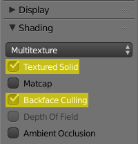

# Assigning textures in your 3D Program
-----

When you import your model, usually you will not immediately see the textures assigned.
Most often you will have to assign them manually to the model.

If your file is an .obj with a .mtl in the same location, your program should automatically assign the textures assuming the texture files are where the .mtl expects them to be. Several other formats also have the ability to embed texture paths, FBX being one of them.

## 3DS Max

### Importing an .obj with a proper .mtl:

1. Check **Show maps in viewport** while viewing **OBJ Import Options** before importing
2. Textures should automatically be assigned and visible in the viewport

 

### Redirecting existing texture paths:

1. After importing your model, **save the scene**
2. Press **Shift+T** to open the **Asset Tracking** window, here you will see any texture paths set prior
3. For each line, right click and select **Set Path**, this opens the **Specify Asset Path** window
4. Use the navigation window to set the path to the new location of the texture its referencing
5. The viewport should now show the textures on the model once the new path has been set

 

### Assigning textures manually:

1. Open the **Slate Material Editor (M)** and scroll down until you find **Scene Materials**
2. The model's materials are located here, double click the one you want to assign a texture to
3. The **Material Node Editor** will appear in the view window, locate the box for a material
4. Attached to the **Diffuse Color property** for your material, there should be a node labeled **Bitmap**, if not, create it
5. **Double click the Bitmap node** and the map window will appear, expand the **Bitmap Parameters** section
6. Click the first option, a window will appear for you to browse to the location of the texture file to assign
7. Right click the Bipmap node, checkmark **Show Shaded Material in Viewport**
8. Repeat this process for each texture you need to assign

 

### Enabling translucency in the viewport:

1. At the top left of your active viewport, **click the third option**, your shading settings
2. In the window that appears, **hover over Materials**, then checkmark **Enable Translucency**

 

 

 
## Blender

### Enabling Textured Solid and Backface Culling:

Blender's viewport by default does not show textures in Solid shading mode, to enable it, **while the viewport editor is open and active, press N** to open a column with additional properties.

Look towards the bottom, find the **Shading** tab, and below it checkmark **Textured Solid** and **Backface Culling**. The column can now be closed if you choose.

The main advantage of this is that you will now be able to see textures under normal shading conditions instead of fullbright in Texture mode. Turning on Backface Culling is also important so you can identify any issues regarding duplicated or missing planes.

### Importing files with embedded texture paths:

Blender is very good about reading texture paths correctly from various model formats that support it. Importing an .obj with a valid .mtl attached should automatically assign the textures to the materials, and immediately appear in the viewport.

Importing an FBX with texture paths will behave differently. The texture paths will be assigned to the materials, but the model's faces won't actually have the textures applied. If you switch to Material shading however, the textures will show but the model will turn black due to a lack of lighting. Create a Hemi light at the center of the grid to illuminate the scene and see the textures.

### Assigning textures directly to the faces:

While most Blender users will insist on assigning textures via materials and lighting a scene, it is actually completely unnecessary, the porting process has no need for Blender's material system. You can simply use the materials to highlight the corresponding faces and open an image file directly onto those faces, bypassing the material system altogether.

1. With your model imported, and **Textured Solid** enabled, **open a new editor window** by dragging the triangle icon located at the top right of the viewport, outward to the left until you are satisfied with the size of the new window
2. With a new editor window active, switch the editor type to the **UV/Image Editor** by clicking the icon in the bottom left of the viewport
3. On the properties panel to the right, **click the orange icon to open material properties**
4. At the top of this section you will see every material name your model uses, **switch to Edit Mode (Tab)**
5. While in Edit Mode, **switch to face selection mode** via the orange cube icon at the bottom middle of the viewport, to the right of the box that says "Global"
6. Highlight a material name and click **Select** below, every face on your model that uses this material will be selected now
7. With the faces selected, and **while still in Edit Mode**, in the **UV/Image Editor** click **Open**
8. Navigate to the texture file that is meant to be assigned to the material you highlighted, open it
9. The texture should be applied to your model now, repeat these steps for each material until your model is fully textured

You do not need to keep reopening the same image over and over for each material, simply highlight the faces and **click the icon to the left of +New** in the **UV/Image Editor** to select an image that has already been added to the scene. **This can also be done with material names.**

pic

### Enabling translucency in the viewport:

1. Select the material which uses translucency, scroll down in the material properties until you find the **Transparency** tab
2. Checkmark the box in front of Transparency, **make sure Z Transparency is the mode being used**

pic

### Enabling texture clamping in the viewport:

1. With the texture open in the **UV/Image Editor, press N** to open a column with additional properties.
2. Find **Game Properties** in the column, **expand it** and you will see check boxes for **Clamp X and Clamp Y**
3. Your texture will be clamped according to how you set these, _these settings apply to **everything using that texture file**_, it is not a per-material setting

pic
